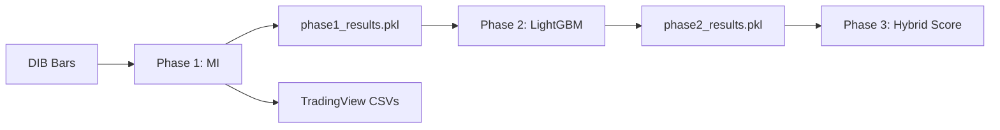

# 📁 Validación Híbrida de Ventanas - Notebooks Organizados

## 🗂️ ESTRUCTURA DE CARPETAS

```
notebooks/
│
├── 📓 01_notebooks/                     ⭐ Notebooks del pipeline (5 archivos)
│   ├── phase1_information_theory.ipynb              (28K) - Source limpio
│   ├── phase1_FINAL_WITH_TRADINGVIEW.ipynb         (842K) - Ejecutado + TradingView
│   ├── phase2_model_performance.ipynb               (22K) - Source limpio
│   ├── phase2_model_performance_FIXED.ipynb        (190K) - Ejecutado + path correcto
│   └── phase3_paper_grade_analysis.ipynb            (21K) - Source limpio
│
├── 📚 02_documentacion/                 ⭐ Guías de uso (4 archivos)
│   ├── README_NOTEBOOKS.md                          - Guía completa de uso
│   ├── README_MODULAR_NOTEBOOKS.md                  - Arquitectura modular
│   ├── REVISION_NOTEBOOK.md                         - Auditoría técnica
│   └── TRADINGVIEW_USAGE_GUIDE.md                   - Cómo usar CSVs en TradingView
│
├── 💾 03_checkpoints/                   ⭐ Resultados intermedios (2 archivos)
│   ├── phase1_results.pkl                           (2.8 MB) - MI scores
│   └── phase2_results.pkl                           (5.0 KB) - AUC/Edge
│
├── 📊 04_outputs/                       ⭐ Resultados finales
│   ├── tradingview_exports/                         (11 CSVs, 44,189 eventos)
│   │   ├── tradingview_E1_VolExplosion.csv          (7,686 eventos)
│   │   ├── tradingview_E10_FirstGreenBounce.csv     (8,494 eventos)
│   │   ├── tradingview_E11_VolumeBounce.csv         (1,256 eventos)
│   │   └── ... (8 archivos más)
│   │
│   ├── *.png                                        (Gráficos de validación)
│   └── *.csv                                        (Resultados tabulares)
│
└── README.md                            ⭐ Este archivo
```

---

## 🚀 INICIO RÁPIDO

### **¿Qué quieres hacer?**

#### 1️⃣ **Ver resultados sin ejecutar nada**
```bash
cd 01_notebooks/
# Abre phase1_FINAL_WITH_TRADINGVIEW.ipynb (ver resultados MI)
# Abre phase2_model_performance_FIXED.ipynb (ver resultados LightGBM)
```

#### 2️⃣ **Visualizar eventos en TradingView**
```bash
cd 04_outputs/tradingview_exports/
# Lee 02_documentacion/TRADINGVIEW_USAGE_GUIDE.md
# Usa los 11 CSVs generados (44,189 eventos con timestamps exactos)
```

#### 3️⃣ **Modificar y re-ejecutar notebooks**
```bash
cd 01_notebooks/
# Edita phase1_information_theory.ipynb
# Ejecuta: jupyter nbconvert --to notebook --execute phase1_information_theory.ipynb
```

#### 4️⃣ **Entender la arquitectura**
```bash
cd 02_documentacion/
# Lee README_NOTEBOOKS.md (guía completa)
# Lee README_MODULAR_NOTEBOOKS.md (arquitectura del pipeline)
```

---

## 📖 DOCUMENTACIÓN PRINCIPAL

| Documento | Descripción | Ubicación |
|-----------|-------------|-----------|
| **README_NOTEBOOKS.md** | Guía completa de uso del pipeline | `02_documentacion/` |
| **TRADINGVIEW_USAGE_GUIDE.md** | Cómo visualizar eventos en TradingView | `02_documentacion/` |
| **README_MODULAR_NOTEBOOKS.md** | Arquitectura modular y checkpoints | `02_documentacion/` |
| **REVISION_NOTEBOOK.md** | Auditoría técnica del notebook original | `02_documentacion/` |

---

## 🎯 RESULTADOS CLAVE

### **Phase 1 - Mutual Information**
- **Problema detectado:** Threshold 10% demasiado bajo
- Todas las ventanas sugeridas son [-3, +3]
- No discrimina entre eventos

### **Phase 2 - LightGBM (CORREGIDO)**
```
E10_FirstGreenBounce:
  [0,0]: AUC=0.963, Edge=1.21%  ⭐ MEJOR
  [1,1]: AUC=0.928, Edge=0.40%

E11_VolumeBounce:
  [0,0]: AUC=0.975, Edge=2.09%  ⭐ MEJOR
  [1,1]: AUC=0.952, Edge=0.97%
```

**Conclusión:** Ventanas pequeñas [0,0] tienen mejor performance económico.

### **TradingView Exports**
- **44,189 eventos** exportados con timestamp exacto
- **11 archivos CSV** (uno por evento E1-E11)
- Listos para validación visual en TradingView

---

## 📦 ARCHIVOS GENERADOS

### **Notebooks ejecutados** (2):
- `01_notebooks/phase1_FINAL_WITH_TRADINGVIEW.ipynb` (842K)
- `01_notebooks/phase2_model_performance_FIXED.ipynb` (190K)

### **Checkpoints** (2):
- `03_checkpoints/phase1_results.pkl` (2.8 MB)
- `03_checkpoints/phase2_results.pkl` (5.0 KB)

### **Outputs TradingView** (11 CSVs):
- `04_outputs/tradingview_exports/*.csv`

### **Gráficos** (múltiples):
- `04_outputs/information_by_day_phase1.png`
- `04_outputs/window_optimization_phase2.png`
- `04_outputs/validation_*.png`

---

## 🔄 PIPELINE COMPLETO



### **Ejecución secuencial:**
```bash
# Phase 1 (~15 min)
cd 01_notebooks/
jupyter nbconvert --to notebook --execute phase1_information_theory.ipynb

# Phase 2 (~30 min)
jupyter nbconvert --to notebook --execute phase2_model_performance.ipynb

# Phase 3 (~10 min)
jupyter nbconvert --to notebook --execute phase3_paper_grade_analysis.ipynb
```

---

## 🛠️ TROUBLESHOOTING

### ❌ Error: "FileNotFoundError: phase1_results.pkl"
**Solución:**
```bash
# El checkpoint debe estar en 03_checkpoints/
# Actualizar paths en notebooks si es necesario
```

### ❌ Error: "n_bars=0" en Phase 2
**Solución:** Ya corregido. Usa `phase2_model_performance.ipynb` actualizado.

### ❌ No encuentro los CSVs de TradingView
**Solución:**
```bash
cd 04_outputs/tradingview_exports/
ls *.csv
```

---

## 📞 AYUDA

- **Problemas con notebooks:** Ver `02_documentacion/README_NOTEBOOKS.md`
- **Problemas con TradingView:** Ver `02_documentacion/TRADINGVIEW_USAGE_GUIDE.md`
- **Problemas técnicos:** Ver `02_documentacion/REVISION_NOTEBOOK.md`

---

## ✅ PRÓXIMOS PASOS

1. **Validación Visual:**
   - Abrir `02_documentacion/TRADINGVIEW_USAGE_GUIDE.md`
   - Seleccionar 10-20 eventos de `04_outputs/tradingview_exports/`
   - Visualizar en TradingView
   - Verificar que ventanas capturan el movimiento

2. **Ajustar Threshold Phase 1:**
   - Editar `01_notebooks/phase1_information_theory.ipynb`
   - Cambiar threshold de 10% a 30-50%
   - Re-ejecutar

3. **Decidir Ventanas Finales:**
   - Comparar resultados Phase 1 vs Phase 2
   - Validar visualmente en TradingView
   - Actualizar `EVENT_WINDOWS_EMPIRICAL` en producción

---

**Última actualización:** 2025-10-30
**Total archivos:** 22 (5 notebooks + 4 docs + 2 checkpoints + 11 CSVs)
**Espacio total:** ~4 MB
