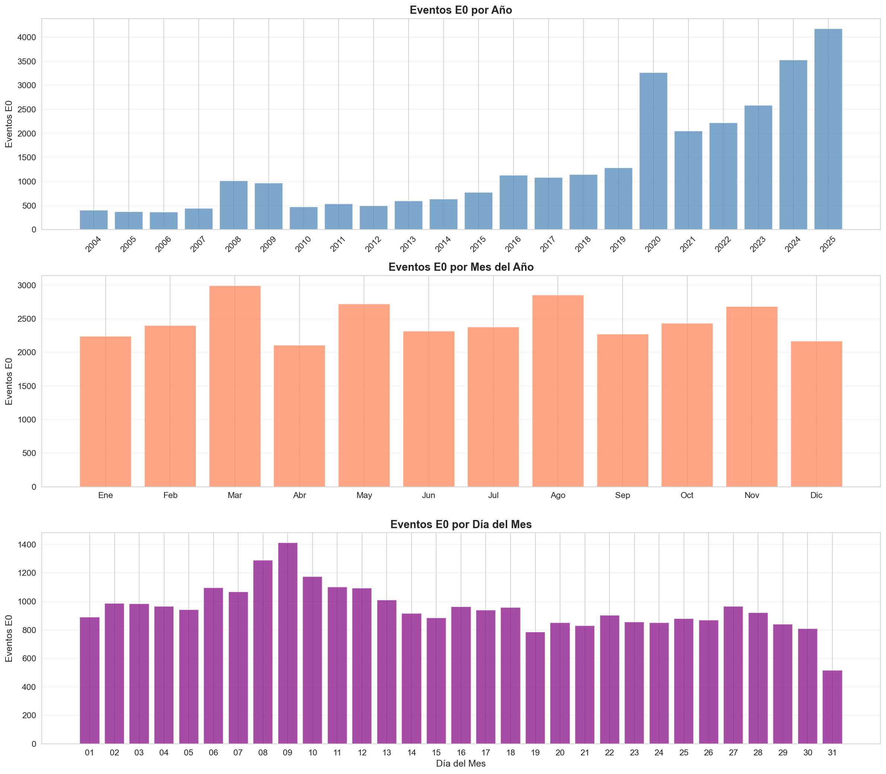
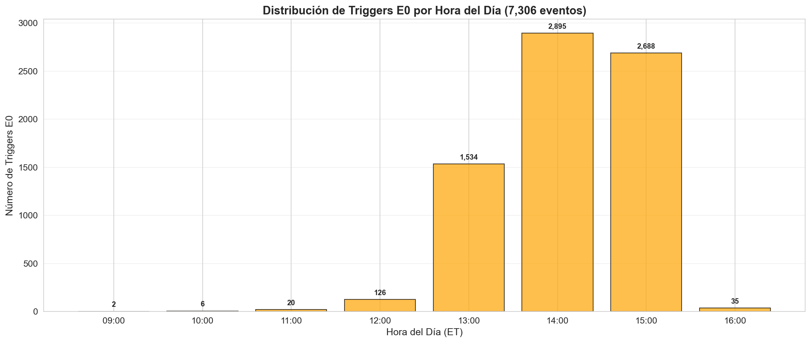
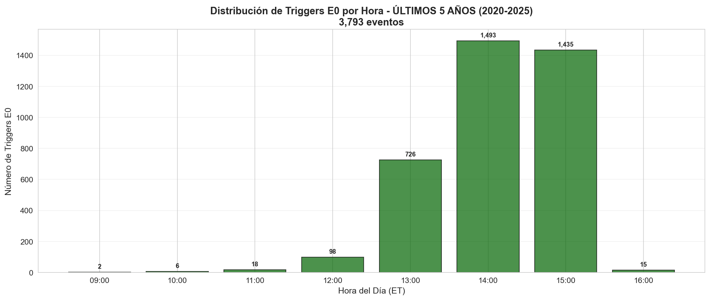

# Validation Pipeline - Checkpoint Map
Certifica la ejecución completa del proyecto desde su inicio, que certifique cada paso completado con evidencia tangible + links a documentación detallada.  
**Última actualización**: 2025-10-30  

## Índice

* **Fundamento Teórico**
    * [Eventos: fases del ciclo pump & dump](#eventos-a--fase-del-ciclo-pump--dump)
    * [Ventanas temporales de estos eventos](#ventanas-temporales-de-estos-eventos)

* **Pipeline Fase 1**
    * [A. Universo](#fase_01--a_universo)
    * [B. Ingesta Daily/Minute](#fase_01--b_ingesta_daily_minut_v2)
    * [C. Ingesta Ticks Event-Driven](#fase_01--c_v2_ingesta_tiks_2004_2025-)
        * [PASO 1: Daily Cache](#paso-1-resumen-diario-desde-barras-1-minuto-390-barras--1-fila)
        * [PASO 2: Configuración Filtros E0](#paso-2-configuración-filtros-e0)
        * [PASO 3: Generación Watchlists E0](#paso-3-generación-watchlists-e0-universeinforichdaily)
        * [PASO 4: Análisis Características E0](#paso-4-análisis-características-e0)
        * [PASO 5: Descarga Ticks Selectiva](#paso-5-descarga-ticks-selectiva)
        * [Estudio datos E0 en mercado](#estudio-datos-e0-en-mercado)
    * [D. Creando DIB/VIB 2004-2025](#fase_01--d_creando_dib_vib_2004_2025)
        * [D.1: Dollar Imbalance Bars](#d1-dollar-imbalance-bars-dib)
        * [D.2: Triple Barrier Labeling](#d2-triple-barrier-labeling)
        * [D.3: Sample Weights](#d3-sample-weights-uniqueness--magnitude--time-decay)
        * [D.4: ML Dataset Builder](#d4-ml-dataset-builder-features--walk-forward-split)
    * [E. Influencia López de Prado](#---a_universo--1_influencia_marcoslopezdepradromd)

**OBJETIVO de este pipeline**  
Descargar datos tick-by-tick (trades) de Polygon API, `SOLO para ventanas temporales donde ocurren eventos clave` detectables en el universo hibrido (8,686 tickers, 21 anos, 3,092 tikers activos y 5,594 inactivos). NO necesitamos ticks de TODO el historico (2004-2025): Solo necesitamos ticks de periodos con `actividad informativa relevante = eventos de pump & dump`. Estos eventos marcan las ventanas temporales criticas para descargar ticks.

**FUNDAMENTO TEORICO**

* Lopez de Prado: Information-Driven Bars : De "Advances in Financial Machine Learning" Cap 2.3.2 (pp. 29-32):

    > "The purpose of information-driven bars is to sample more frequently when new information arrives to the market."
    >
    >**Dollar Imbalance Bars (DIBs)** y **Dollar Runs Bars (DRBs)** requieren datos tick-by-tick:
    >- **DIBs:** Detectan desbalance compra/venta (pump initiation)
    >- **DRBs:** Detectan sweeping agresivo (informed traders)

* EduTrades: Eventos Clave en Small Caps : Del Playbook Operativo (14 estrategias)
    > 1. **Explosion de volumen** (RVOL > 5x)
    > 2. **Gaps significativos** (>15%)
    > 3. **Movimientos parabolicos** (>50% en 1-5 dias)
    > 4. **First Red Day** (primer dia rojo tras corrida)
    > 5. **Dilution events** (offerings, correlacionados con colapsos)


## EVENTOS a : fase del ciclo pump & dump:

```
FASE 1: DORMIDO (skip - no descargar ticks)
    +-- Bajo volumen, sin volatilidad

FASE 2: CATALIZADOR (EVENTO 1)
    +-- [E1] Volume Explosion: RVOL > 5x
    +-- [E2] Gap Up Significativo: Gap > 10%
    +-- [E3] Price Spike Intraday: +20% intradía

FASE 3: PUMP / EXTENSION (EVENTO 2)
    +-- [E4] Parabolic Move: +50% en 1-5 dias
    +-- [E5] Breakout ATH/52W: Nuevo high
    +-- [E6] Multiple Green Days: 3+ dias verdes consecutivos

FASE 4: DUMP / COLLAPSE (EVENTO 3)
    +-- [E7] First Red Day (FRD): Primer dia rojo post-pump
    +-- [E8] Gap Down Violento: Gap < -15%
    +-- [E9] Crash Intraday: -30% en <2 horas

FASE 5: BOUNCE (EVENTO 4)
    +-- [E10] First Green Day Bounce: Verde post-dump
    +-- [E11] Volume Spike on Bounce: RVOL > 3x en rebote

FASE 6: MUERTE (skip - no descargar ticks)
    +-- Volver a niveles base, dormido
```

**Eventos Especiales (Ortogonales al Ciclo)**

```
DILUTION EVENTS (EVENTO 5)
    +-- [E12] S-3 Effective Date +/- 2 dias
    +-- [E13] 424B Pricing Date +/- 2 dias
    +-- [E14] Warrant Exercise Events

MICROSTRUCTURE ANOMALIES (EVENTO 6)
    +-- [E15] Halts (LUDP, LUDS)
    +-- [E16] SSR Trigger (Short Sale Restriction)
    +-- [E17] Extreme Spread Events (bid/ask > 10%)
```

**VENTANAS temporales de estos eventos**

Para cada evento detectado, descargar ticks en ventana

* E0 -> +1 -1


# Pipeline

## fase_01 / A_universo  (34,380 tickers - activos + inactivos)

**Objetivo**: descargar universo completo 2004-2025 (34,380 tickers - activos + inactivos).   
**Script:** [scripts/fase_A_Universo/ingest_reference_universe.py](../scripts/fase_A_Universo/ingest_reference_universe.py)    
Sirve para ingestar el universo de referencia desde Polygon (tickers activos e inactivos, splits, dividends, detalles), y dejarlo normalizado/particionado en raw/polygon/reference/... y derivados. Es la “materia prima” de la Fase A (snapshot completo), sobre la que luego operan los constructores del universo híbrido.  
Construye universo completo (activos + delistados), sin sesgo de supervivencia, con paginación y checkpoint..    
**Fuente de datos**: Polygon API (tickers snapshot histórico)  
**Pasos implementacion**: [3.1_ingest_reference_universe_v2.md](../01_DayBook/fase_01/A_Universo/3.1_ingest_reference_universe_v2.md)  

```bash
D:\04_TRADING_SMALLCAPS\
├── raw\polygon\reference\tickers_snapshot\
│   │
│   └── snapshot_date=2025-10-24\              UNIVERSO COMPLETO
│       ├── tickers_all.parquet                (34,380 tickers - activos + inactivos)
│       ├── tickers_active.parquet             (11,853 tickers - solo activos)
│       └── tickers_inactive.parquet           (22,527 tickers - solo inactivos)
│
└── temp_active_counts_complete.csv            (resumen CSV con conteos)
```

### Enriquecimiento tickers activos con datos corporativos.

```sh
D:\04_TRADING_SMALLCAPS\
├── raw\polygon\reference\tickers_snapshot\
    │
    └── snapshot_date=2025-10-24\              UNIVERSO COMPLETO
        ├── tickers_all.parquet                (34,380 tickers - activos + inactivos)
        ├── tickers_active.parquet             (11,853 tickers - solo activos)
        └── tickers_inactive.parquet           (22,527 tickers - solo inactivos)

        NUEVOS FILTROS A 34,380 tickers - activos + inactivos
                      ↓
            Filtro: type=CS, exchange=XNAS/XNYS
            ├─ Activos: 5,005
            └─ Inactivos: 5,594
            RESULTADO: 10,599 CS en XNAS/XNYS
                      ↓
            ENRIQUECIMIENTO con datos corporativos: 
            ├─ 5,234 activos con market_cap válido
            └─ 5,358 inactivos con error:not_found (sin market_cap)
            Resultado: 10,592 procesados (-7 fallidos)
```

**Objetivo** : Enriquecer tickers activos con datos corporativos (market_cap, employees, description).  
**Script:** [scripts/fase_A_Universo/ingest_ticker_details.py](../scripts/fase_A_Universo/ingest_ticker_details.py)  
Enriquecer tickers activos con datos corporativos (market_cap, employees, description).  
**Fuente de datos**: Polygon `/v3/reference/tickers/{ticker}`  
**Pasos implementacion**: 
* [3_descarga_Universo_y_referencia.md](../01_DayBook/fase_01/A_Universo/3_descarga_Universo_y_referencia.md) 
* [3.1_ingest_reference_universe_v2.md](../01_DayBook/fase_01/A_Universo/3.1_ingest_reference_universe_v2.md) 
* [3.2_ingest_ticker_detail.md](../01_DayBook/fase_01/A_Universo/3.2_ingest_ticker_detail.md)    
 

**Notebook**  
**Output**: [raw/polygon/reference/ticker_details/as_of_date=2025-10-24/details.parquet](../raw/polygon/reference/ticker_details/as_of_date=2025-10-19/details.parquet)  

```
Total rows:      10,482
Total columns:       27

📋 COLUMNAS (27):

📊 HEAD(5):
----------------------------------------------------------------------------------------------------
shape: (27, 3)
┌────────────────────────────────┬─────────────────────────────────┬─────────────────────────────────┐
│ column                         ┆ column_0                        ┆ column_1                        │
╞════════════════════════════════╪═════════════════════════════════╪═════════════════════════════════╡
│ ticker                         ┆ AEM                             ┆ FLXS                            │
│ name                           ┆ Agnico Eagle Mines Ltd.         ┆ Flexsteel Industries            │
│ market                         ┆ stocks                          ┆ stocks                          │
│ locale                         ┆ us                              ┆ us                              │
│ primary_exchange               ┆ XNYS                            ┆ XNAS                            │
│ type                           ┆ CS                              ┆ CS                              │
│ active                         ┆ true                            ┆ true                            │
│ currency_name                  ┆ usd                             ┆ usd                             │
│ cik                            ┆ 0000002809                      ┆ 0000037472                      │
│ composite_figi                 ┆ BBG000DLVDK3                    ┆ BBG000BJNBB3                    │
│ share_class_figi               ┆ BBG001S77MK3                    ┆ BBG001S5R835                    │
│ market_cap                     ┆ 87653650345.3                   ┆ 202966296.60999998              │
│ description                    ┆ Agnico Eagle is a gold miner w… ┆ Flexsteel Industries Inc is a … │
│ ticker_root                    ┆ AEM                             ┆ FLXS                            │
│ homepage_url                   ┆ https://www.agnicoeagle.com     ┆ https://www.flexsteel.com       │
│ total_employees                ┆ 16968                           ┆ 1400                            │
│ list_date                      ┆ 1972-06-07                      ┆ 1972-06-01                      │
│ branding                       ┆ {"https://api.polygon.io/v1/re… ┆ {"https://api.polygon.io/v1/re… │
│ share_class_shares_outstanding ┆ 502814045                       ┆ 5275963                         │
│ weighted_shares_outstanding    ┆ 502341970                       ┆ 5275963                         │
│ round_lot                      ┆ 100                             ┆ 100                             │
│ as_of_date                     ┆ 2025-10-19                      ┆ 2025-10-19                      │
│ phone_number                   ┆ null                            ┆ (319) 556-7730                  │
│ address                        ┆ null                            ┆ null                            │
│ sic_code                       ┆ null                            ┆ 2510                            │
│ sic_description                ┆ null                            ┆ HOUSEHOLD FURNITURE             │
│ ticker_suffix                  ┆ null                            ┆ null                            │
└────────────────────────────────┴─────────────────────────────────┴─────────────────────────────────┘

📊 HEAD(5) - Solo columnas clave:
----------------------------------------------------------------------------------------------------
shape: (7, 3)
┌──────────────────┬─────────────────────────┬──────────────────────┐
│ column           ┆ column_0                ┆ column_1             │
╞══════════════════╪═════════════════════════╪══════════════════════╡
│ ticker           ┆ AEM                     ┆ FLXS                 │
│ name             ┆ Agnico Eagle Mines Ltd. ┆ Flexsteel Industries │
│ market_cap       ┆ 87653650345.3           ┆ 202966296.60999998   │
│ primary_exchange ┆ XNYS                    ┆ XNAS                 │
│ active           ┆ true                    ┆ true                 │
│ type             ┆ CS                      ┆ CS                   │
│ as_of_date       ┆ 2025-10-19              ┆ 2025-10-19           │
└──────────────────┴─────────────────────────┴──────────────────────┘

📊 COMPLETITUD:
----------------------------------------------------------------------------------------------------
ticker                        : 10,482 / 10,482 (100.0%)
name                          : 10,114 / 10,482 ( 96.5%)
market                        : 10,114 / 10,482 ( 96.5%)
locale                        : 10,114 / 10,482 ( 96.5%)
primary_exchange              : 10,114 / 10,482 ( 96.5%)
type                          : 10,114 / 10,482 ( 96.5%)
active                        : 10,114 / 10,482 ( 96.5%)
currency_name                 : 10,114 / 10,482 ( 96.5%)
cik                           :  9,138 / 10,482 ( 87.2%)
composite_figi                :  8,533 / 10,482 ( 81.4%)
share_class_figi              :  8,306 / 10,482 ( 79.2%)
market_cap                    :  5,608 / 10,482 ( 53.5%)
description                   :  6,330 / 10,482 ( 60.4%)
ticker_root                   : 10,114 / 10,482 ( 96.5%)
homepage_url                  :  6,026 / 10,482 ( 57.5%)
total_employees               :  5,298 / 10,482 ( 50.5%)
list_date                     : 10,032 / 10,482 ( 95.7%)
branding                      :  5,442 / 10,482 ( 51.9%)
share_class_shares_outstanding:  9,257 / 10,482 ( 88.3%)
weighted_shares_outstanding   :  5,634 / 10,482 ( 53.7%)
round_lot                     : 10,114 / 10,482 ( 96.5%)
as_of_date                    : 10,482 / 10,482 (100.0%)
phone_number                  :  5,107 / 10,482 ( 48.7%)
address                       :  5,107 / 10,482 ( 48.7%)
sic_code                      :  5,032 / 10,482 ( 48.0%)
sic_description               :  5,014 / 10,482 ( 47.8%)
ticker_suffix                 :    884 / 10,482 (  8.4%)
```

---


### Descarga de Splits & Dividends (Datos globales)

**Objetivo**: Obtener eventos corporativos históricos (splits, dividends) para ajustes de precio.  
**Script**: [scripts/fase_A_universo/ingest_splits_dividends.py](../scripts/fase_A_Universo/ingest_splits_dividends.py)    
**Fuente de datos**: Polygon `/v3/reference/splits` y `/v3/reference/dividends` (sin filtros) 

```sh
D:\04_TRADING_SMALLCAPS\
├── raw\polygon\reference\
    │
    ├─ DESCARGA GLOBAL (sin filtros - TODOS los tickers de Polygon)
    │  Script: ingest_splits_dividends.py
    │  Endpoint: /v3/reference/splits (sin filtros)
    │  Endpoint: /v3/reference/dividends (sin filtros)
    │       ↓
    ├── splits/
    │   └── year=*/splits.parquet
    │       ├─ Total: 26,641 splits
    │       ├─ Tickers únicos: 18,423
    │       └─ Período: 1978-2025 (48 años)
    │
    └── dividends/
        └── year=*/dividends.parquet
            ├─ Total: 1,878,357 dividends
            ├─ Tickers únicos: 75,198
            └─ Período: 2000-2030 (31 años)
            
                ↓ 
                
            FILTRADO para nuestro universo (8,686 tickers)
            Script: filter_splits_dividends_universe.py
            Input: cs_xnas_xnys_hybrid_enriched_2025-10-24.parquet
            ENRIQUECIMIENTO Splits & Dividends
            processed/corporate_actions/
            │
            ├── splits_universe_2025-10-24.parquet
            │   ├─ 4,012 splits (de 26,641 globales)
            │   ├─ 2,420 tickers con splits (27.9% de 8,686)
            │   └─ Reducción: 84.9%
            │
            ├── dividends_universe_2025-10-24.parquet
            │   ├─ 94,546 dividends (de 1,878,357 globales)
            │   ├─ 2,723 tickers con dividends (31.4% de 8,686)
            │   └─ Reducción: 95.0%
            │
            └── corporate_actions_lookup_2025-10-24.parquet
                └─ Lookup table: ticker → has_splits, has_dividends, counts
```

**Output**:  

* **Datos descargados (globales)**: Backup global, nunca lo borres
    ```bash
    raw/polygon/reference/
    ├── splits/
    │   └── year=*/splits.parquet         (26,641 splits, 1978-2025, 18,423 tickers)
    └── dividends/
        └── year=*/dividends.parquet      (1,878,357 dividends, 2000-2030, 75,198 tickers)
    ```
* **Datos filtrados para universo (8,686 tickers):** Usas ESTE en tu código (más rápido, más pequeño)

    ```sh
    processed/corporate_actions/
    ├── splits_universe_2025-10-24.parquet       (4,012 splits, 2,420 tickers, 27.9% cobertura)
    ├── dividends_universe_2025-10-24.parquet    (94,546 dividends, 2,723 tickers, 31.4% cobertura)
    └── corporate_actions_lookup_2025-10-24.parquet (lookup table con flags has_splits/has_dividends)
    ``` 

**Estado**: Ejecutado  - Datos globales reutilizables   
**Documentación**: [3.3_split_dividens.md](../01_DayBook/fase_01/A_Universo/3.3_split_dividens.md)  

```
📊 1. SPLITS (raw/polygon/reference/splits/year=*/splits.parquet)
----------------------------------------------------------------------------------------------------
Archivos encontrados: 31

Total rows (sample):           1
Total columns:                 6

📊 HEAD(5) TRANSPUESTO:
----------------------------------------------------------------------------------------------------
shape: (6, 2)
┌────────────────┬─────────────────────────────────┐
│ column         ┆ column_0                        │
╞════════════════╪═════════════════════════════════╡
│ execution_date ┆ 1978-10-25                      │
│ id             ┆ Pef962e8ce572df20933cdaac3a2d2… │
│ split_from     ┆ 2.0                             │
│ split_to       ┆ 3.0                             │
│ ticker         ┆ AMD                             │
│ ratio          ┆ 0.6666666666666666              │
└────────────────┴─────────────────────────────────┘

📊 ESTADÍSTICAS GLOBALES (todos los años):
----------------------------------------------------------------------------------------------------
Total splits:             26,641
Tickers únicos:           18,423
Años disponibles:       1978-2025 (31 años)


📊 2. DIVIDENDS (raw/polygon/reference/dividends/year=*/dividends.parquet)
----------------------------------------------------------------------------------------------------
Archivos encontrados: 31

Total rows (sample):           1
Total columns:                10

📊 HEAD(5) TRANSPUESTO:
----------------------------------------------------------------------------------------------------
shape: (10, 2)
┌──────────────────┬─────────────────────────────────┐
│ column           ┆ column_0                        │
╞══════════════════╪═════════════════════════════════╡
│ cash_amount      ┆ 0.15                            │
│ currency         ┆ CNY                             │
│ dividend_type    ┆ CD                              │
│ ex_dividend_date ┆ 2000-08-15                      │
│ frequency        ┆ 1                               │
│ id               ┆ E4a7d4e17e772232caf90d14c98574… │
│ pay_date         ┆ 2000-08-18                      │
│ record_date      ┆ 2000-08-16                      │
│ ticker           ┆ CHVKF                           │
│ declaration_date ┆ null                            │
└──────────────────┴─────────────────────────────────┘

📊 ESTADÍSTICAS GLOBALES (todos los años):
----------------------------------------------------------------------------------------------------
Total dividends:        1,878,357
Tickers únicos:           75,198
Años disponibles:       2000-2030 (31 años)
```


### Filtro para poblacion target : Small Caps (market cap < $2B, XNAS/XNYS, CS)
---  
  
>**[ADVERTENCIA]**  
**Polygon API `/v3/reference/tickers/{ticker}` NO devuelve `market_cap` para tickers inactivos/delistados.**  
>Esto significa:
>- [X] Imposible filtrar inactivos por market_cap historico
>- [X] Si solo usamos activos < $2B -> **SURVIVORSHIP BIAS SEVERO**
>- [X] Perdemos 5,594 tickers delistados (los MAS importantes para entrenar pump & dump terminal)


**Objetivo**: descargar universo completo 2004-2025 (34,380 tickers - activos + inactivos)   
**Scripts:**  [`create_hybrid_universe.py`](../scripts/fase_A_Universo/create_hybrid_universe.py)   
Construye el “universo híbrido” de small caps sin sesgo de supervivencia a partir de los datos de referencia ya descargados en: 
```
snapshot_date=2025-10-24\                  
    ├── tickers_all.parquet                (34,380 tickers - activos + inactivos)
    ├── tickers_active.parquet             (11,853 tickers - solo activos)
    └── tickers_inactive.parquet           (22,527 tickers - solo inactivos) 
```
**Pasos implementacion real**: [3.1_ingest_reference_universe_v2.md](../01_DayBook/fase_01/A_Universo/3.1_ingest_reference_universe_v2.md)


Pipeline ejecutado:

```sh
D:\04_TRADING_SMALLCAPS\
├── raw\polygon\reference\tickers_snapshot\
    │
    └── snapshot_date=2025-10-24\              UNIVERSO COMPLETO
        ├── tickers_all.parquet                (34,380 tickers - activos + inactivos)
        ├── tickers_active.parquet             (11,853 tickers - solo activos)
        └── tickers_inactive.parquet           (22,527 tickers - solo inactivos)

        NUEVOS FILTROS A 34,380 tickers - activos + inactivos
                      ↓
            FILTRO: type=CS, exchange=XNAS/XNYS
            ├─ Activos: 5,005
            └─ Inactivos: 5,594
            RESULTADO: 10,599 CS en XNAS/XNYS
                      ↓
            ENRIQUECIMIENTO con datos corporativos: 
            ├─ 5,234 activos con market_cap válido
            └─ 5,358 inactivos con error:not_found (sin market_cap)
            RESULTADO: 10,592 procesados (-7 fallidos)
                      ↓
            FILTRO market_cap < $2B (SOLO ACTIVOS) ✅ El actual - poblacion target
            ├─ Activos: 3,092 ← FILTRADOS
            └─ Inactivos: 5,594 ← SIN FILTRAR (todos)(ANTI-SURVIVORSHIP BIAS)
            RESULTADO: 8,686 tickers (Universo Híbrido para descargar OHLCV)
                                │
            ┌────────────────────────────────────────┐
            │             (esperando)                │ 
            │   DESCARGA GLOBAL SPLITS & DIVIDENDS   │    
            └────────────────────────────────────────┘                 
                                │
                    ┌───────────┘
                    ↓
            ENRIQUECIMIENTO Splits & Dividends
            (solo para 8,686 tickers Universo Híbrido)
            processed/corporate_actions/
            │
            ├── splits_universe_2025-10-24.parquet
            │   ├─ 4,012 splits (de 26,641 globales)
            │   ├─ 2,420 tickers con splits (27.9% de 8,686)
            │   └─ Reducción: 84.9%
            │
            ├── dividends_universe_2025-10-24.parquet
            │   ├─ 94,546 dividends (de 1,878,357 globales)
            │   ├─ 2,723 tickers con dividends (31.4% de 8,686)
            │   └─ Reducción: 95.0%
            │
            └── corporate_actions_lookup_2025-10-24.parquet
                └─ Lookup table: ticker → has_splits, has_dividends, counts
                    ↓
            RESULTADO: 8,686 tickers (Universo Híbrido para descargar OHLCV)
                    ↓
                Exporta:
                - cs_xnas_xnys_hybrid_2025-10-24.parquet (SIN market_cap aún)
                - cs_xnas_xnys_hybrid_2025-10-24.csv (6 columnas básicas)  
```

`cs_xnas_xnys_hybrid_2025-10-24.csv` y  
`cs_xnas_xnys_hybrid_2025-10-24.parquet`  
**no** tienen market_cap: El CSV se usa solo como input para scripts de descarga (como ingest_ohlcv_daily.py) que solo necesitan el ticker. 
```
📊 1. cs_xnas_xnys_hybrid_2025-10-24.parquet
----------------------------------------------------------------------------------------------------
Total tickers:        8,686
Activos:              3,092
Inactivos:            5,594
Columnas:                14
shape: (14, 3)
┌──────────────────┬─────────────────────────────────┬─────────────────────────────────┐
│ column           ┆ 0                               ┆ 1                               │
╞══════════════════╪═════════════════════════════════╪═════════════════════════════════╡
│ ticker           ┆ AACB                            ┆ AACI                            │
│ name             ┆ Artius II Acquisition Inc. Cla… ┆ Armada Acquisition Corp. II Cl… │
│ market           ┆ stocks                          ┆ stocks                          │
│ locale           ┆ us                              ┆ us                              │
│ primary_exchange ┆ XNAS                            ┆ XNAS                            │
│ type             ┆ CS                              ┆ CS                              │
│ active           ┆ true                            ┆ true                            │
│ currency_name    ┆ usd                             ┆ usd                             │
│ cik              ┆ 0002034334                      ┆ 0002044009                      │
│ composite_figi   ┆ null                            ┆ null                            │
│ share_class_figi ┆ null                            ┆ null                            │
│ last_updated_utc ┆ 2025-10-22T14:39:56.53685577Z   ┆ 2025-10-22T14:39:56.536856281Z  │
│ snapshot_date    ┆ 2025-10-24                      ┆ 2025-10-24                      │
│ delisted_utc     ┆ null                            ┆ null                            │
└──────────────────┴─────────────────────────────────┴─────────────────────────────────┘
```

### Implementacion enriquecimiento

**Objetivo** : Es el último paso de la Fase A: el que produce el universo híbrido enriquecido, que usará la Fase B (descarga OHLCV daily + intraday).  
**Polygon API limitation:** El endpoint `/v3/reference/tickers/{ticker}` NO retorna informacion completa para tickers delisted/inactivos  
**Market cap imposible:** No existe `market_cap` historico en el momento del delisting (Polygon no lo guarda)  
**Documentado** : [4.1_estrategia_dual_enriquecimiento.md](../01_DayBook/fase_01/A_Universo/4.1_problemas_&_decisiones.md) y [4.2_inactivos_sin_data.md](./fase_01/A_Universo/4.2_inactivos_sin_data.md)

El snapshot de `/v3/reference/tickers` descargado el 2025-10-24 **SI** contiene informacion basica para tickers inactivos. 

**script** : [`scripts/fase_A_universo/enrich_hybrid_universe.py`](../scripts/fase_A_Universo/enrich_hybrid_universe.py)  
**Output** :  [processed/universe/cs_xnas_xnys_hybrid_enriched_2025-10-24.parquet](../processed/universe/cs_xnas_xnys_hybrid_enriched_2025-10-24.parquet)


[`cs_xnas_xnys_hybrid_enriched_2025-10-24.parquet`](../processed/universe/cs_xnas_xnys_hybrid_enriched_2025-10-24.parquet) **SÍ** tiene market_cap y 23 columnas completas:

    ```sh
    Total tickers:        8,686
    Activos:              3,092
    Inactivos:            5,594
    Total columnas:          23

    📋 PARQUET: 23 columnas (dataset completo con todas las features)
    ----------------------------------------------------------------------------------------------------
    ['active', 'cik', 'composite_figi', 'currency_name', 'delisted_utc', 'description', 'homepage_url', 'last_updated_utc', 'list_date', 'locale', 'market', 'market_cap', 'name', 'primary_exchange', 'share_class_figi', 'share_class_shares_outstanding', 'sic_code', 'sic_description', 'snapshot_date', 'ticker', 'total_employees', 'type', 'weighted_shares_outstanding']

    📊 HEAD(5) - Activos con market_cap
    ----------------------------------------------------------------------------------------------------
    shape: (5, 5)
    ┌────────┬─────────────────────────────────┬─────────────┬──────────────────┬────────┐
    │ ticker ┆ name                            ┆ market_cap  ┆ primary_exchange ┆ active │
    ╞════════╪═════════════════════════════════╪═════════════╪══════════════════╪════════╡
    │ AACB   ┆ Artius II Acquisition Inc. Cla… ┆ 2.828385e8  ┆ XNAS             ┆ true   │
    │ AACI   ┆ Armada Acquisition Corp. II Cl… ┆ 3.237975e8  ┆ XNAS             ┆ true   │
    │ AAM    ┆ AA Mission Acquisition Corp.    ┆ 4.6568466e8 ┆ XNYS             ┆ true   │
    │ AAME   ┆ Atlantic American Corp          ┆ 6.2587e7    ┆ XNAS             ┆ true   │
    │ AAMI   ┆ Acadian Asset Management Inc.   ┆ 1.7043e9    ┆ XNYS             ┆ true   │
    └────────┴─────────────────────────────────┴─────────────┴──────────────────┴────────┘

    📊 HEAD(5) - Inactivos (market_cap = null, delisted_utc presente)
    ----------------------------------------------------------------------------------------------------
    shape: (5, 5)
    ┌────────┬─────────────────────────────────┬────────────┬──────────────────────┬────────┐
    │ ticker ┆ name                            ┆ market_cap ┆ delisted_utc         ┆ active │
    ╞════════╪═════════════════════════════════╪════════════╪══════════════════════╪════════╡
    │ AABA   ┆ Altaba Inc. Common Stock        ┆ null       ┆ 2019-10-07T04:00:00Z ┆ false  │
    │ AAC    ┆ Ares Acquisition Corporation    ┆ null       ┆ 2023-11-07T05:00:00Z ┆ false  │
    │ AACQ   ┆ Artius Acquisition Inc. Class … ┆ null       ┆ 2021-06-25T04:00:00Z ┆ false  │
    │ AACT   ┆ Ares Acquisition Corporation I… ┆ null       ┆ 2025-09-25T00:00:00Z ┆ false  │
    │ AADI   ┆ Aadi Bioscience, Inc. Common S… ┆ null       ┆ null                 ┆ false  │
    └────────┴─────────────────────────────────┴────────────┴──────────────────────┴────────┘

    📊 COMPLETITUD: Columnas clave
    ----------------------------------------------------------------------------------------------------
    market_cap               : Activos 3,092/3,092 (100.0%)  |  Inactivos     0/5,594 (  0.0%)
    delisted_utc             : Activos     0/3,092 (  0.0%)  |  Inactivos 5,393/5,594 ( 96.4%)
    description              : Activos 3,092/3,092 (100.0%)  |  Inactivos     0/5,594 (  0.0%)
    sic_code                 : Activos 2,469/3,092 ( 79.9%)  |  Inactivos     0/5,594 (  0.0%)
    composite_figi           : Activos 2,409/3,092 ( 77.9%)  |  Inactivos 2,403/5,594 ( 43.0%)
    ```

```sh 
D:\04_TRADING_SMALLCAPS\
├── raw\polygon\reference\tickers_snapshot\
    │
    └── snapshot_date=2025-10-24\              UNIVERSO COMPLETO
        ├── tickers_all.parquet                (34,380 tickers - activos + inactivos)
        ├── tickers_active.parquet             (11,853 tickers - solo activos)
        └── tickers_inactive.parquet           (22,527 tickers - solo inactivos)

        NUEVOS FILTROS A 34,380 tickers - activos + inactivos
                      ↓
            FILTRO: type=CS, exchange=XNAS/XNYS
            ├─ Activos: 5,005
            └─ Inactivos: 5,594
            RESULTADO: 10,599 CS en XNAS/XNYS
                      ↓
            ENRIQUECIMIENTO con datos corporativos: 
            ├─ 5,234 activos con market_cap válido
            └─ 5,358 inactivos con error:not_found (sin market_cap)
            RESULTADO: 10,592 procesados (-7 fallidos)
                      ↓
            FILTRO market_cap < $2B (SOLO ACTIVOS) ✅ El actual - poblacion target
            ├─ Activos: 3,092 ← FILTRADOS
            └─ Inactivos: 5,594 ← SIN FILTRAR (todos)(ANTI-SURVIVORSHIP BIAS)
            RESULTADO: 8,686 tickers (Universo Híbrido para descargar OHLCV)
                                │
            ┌────────────────────────────────────────┐
            │             (esperando)                │ 
            │   DESCARGA GLOBAL SPLITS & DIVIDENDS   │    
            └────────────────────────────────────────┘                 
                                │
                    ┌───────────┘
                    ↓
            ENRIQUECIMIENTO Splits & Dividends
            (solo para 8,686 tickers Universo Híbrido)
            processed/corporate_actions/
            │
            ├── splits_universe_2025-10-24.parquet
            │   ├─ 4,012 splits (de 26,641 globales)
            │   ├─ 2,420 tickers con splits (27.9% de 8,686)
            │   └─ Reducción: 84.9%
            │
            ├── dividends_universe_2025-10-24.parquet
            │   ├─ 94,546 dividends (de 1,878,357 globales)
            │   ├─ 2,723 tickers con dividends (31.4% de 8,686)
            │   └─ Reducción: 95.0%
            │
            └── corporate_actions_lookup_2025-10-24.parquet
                └─ Lookup table: ticker → has_splits, has_dividends, counts
                    ↓
            ENRIQUECIMIENTO DUAL (Activos vs Inactivos)
            Script: enrich_hybrid_universe.py
            ├─ Activos (3,092): JOIN con ticker_details
            │   └─ Añade: market_cap, description, sic_description, 
            │              total_employees, homepage_url
            │
            └─ Inactivos (5,594): JOIN con snapshot
                └─ Añade: delisted_utc, composite_figi, share_class_figi
                    ↓
            RESULTADO: 8,686 tickers ENRIQUECIDOS (23 columnas)
            processed/universe/cs_xnas_xnys_hybrid_enriched_2025-10-24.parquet
            │
            │ Columnas: ticker, name, market, locale, primary_exchange, type,
            │          active, currency_name, cik, composite_figi, share_class_figi,
            │          market_cap, description, homepage_url, total_employees,
            │          list_date, share_class_shares_outstanding,
            │          weighted_shares_outstanding, sic_code, sic_description,
            │          snapshot_date, last_updated_utc, delisted_utc
            │
            │ Completitud:
            │  ├─ market_cap: 3,092/8,686 (35.6%) - SOLO activos
            │  ├─ delisted_utc: 5,594/8,686 (64.4%) - SOLO inactivos
            │  ├─ composite_figi: 8,686/8,686 (100%)
            └─────────────────────────────────────────────────────────
```

**¿Dónde se ejecuta este filtrado?**
* EVIDENCIA de los resultados: [A_Universo / notebooks / notebook2.ipynb](../01_DayBook/fase_01/A_Universo/notebooks/notebook2.ipynb)  
* 


## fase_01 / B_ingesta_Daily_&_Minut

**Objetivo**: Descargar `OHLCV (Open, High, Low, Close, Volume)` completo del Universo Híbrido: 8,686 tickers.  
**Propósito del OHLCV:** 

* Eliminar survivorship bias (López de Prado Ch.1)
* Preparar datos para Event Detection (pumps & dumps)
* Base para construcción de DIB bars (Cap.2)
* Input para features técnicos (RVOL, volatility, %change)

**Fuente de datos**: `Polygon /v2/aggs/ticker/{ticker}/range/{multiplier}/{timespan}/{from}/{to}`
**Input**: `processed/universe/cs_xnas_xnys_hybrid_2025-10-24.csv (8,686 tickers)
**Período**: 2004-01-01 → 2025-10-24 (21 años)


**Universo**:
- CSV: `processed/universe/cs_xnas_xnys_hybrid_2025-10-24.csv` (8,686 tickers)
- Parquet enriched: `processed/universe/cs_xnas_xnys_hybrid_enriched_2025-10-24.parquet`

```sh 
D:\04_TRADING_SMALLCAPS\
├── raw\polygon\reference\tickers_snapshot\
    │
    └── snapshot_date=2025-10-24\              UNIVERSO COMPLETO
        ├── tickers_all.parquet                (34,380 tickers - activos + inactivos)
        ├── tickers_active.parquet             (11,853 tickers - solo activos)
        └── tickers_inactive.parquet           (22,527 tickers - solo inactivos)

        NUEVOS FILTROS A 34,380 tickers - activos + inactivos
                      ↓
            FILTRO: type=CS, exchange=XNAS/XNYS
            ├─ Activos: 5,005
            └─ Inactivos: 5,594
            RESULTADO: 10,599 CS en XNAS/XNYS
                      ↓
            ENRIQUECIMIENTO con datos corporativos: 
            ├─ 5,234 activos con market_cap válido
            └─ 5,358 inactivos con error:not_found (sin market_cap)
            RESULTADO: 10,592 procesados (-7 fallidos)
                      ↓
            FILTRO market_cap < $2B (SOLO ACTIVOS) ✅ El actual - poblacion target
            ├─ Activos: 3,092 ← FILTRADOS
            └─ Inactivos: 5,594 ← SIN FILTRAR (todos)(ANTI-SURVIVORSHIP BIAS)
            RESULTADO: 8,686 tickers (Universo Híbrido para descargar OHLCV)
                                │
            ┌────────────────────────────────────────┐
            │             (esperando)                │ 
            │   DESCARGA GLOBAL SPLITS & DIVIDENDS   │    
            └────────────────────────────────────────┘                 
                                │
                    ┌───────────┘
                    ↓
            ENRIQUECIMIENTO Splits & Dividends
            (solo para 8,686 tickers Universo Híbrido)
            processed/corporate_actions/
            │
            ├── splits_universe_2025-10-24.parquet
            │   ├─ 4,012 splits (de 26,641 globales)
            │   ├─ 2,420 tickers con splits (27.9% de 8,686)
            │   └─ Reducción: 84.9%
            │
            ├── dividends_universe_2025-10-24.parquet
            │   ├─ 94,546 dividends (de 1,878,357 globales)
            │   ├─ 2,723 tickers con dividends (31.4% de 8,686)
            │   └─ Reducción: 95.0%
            │
            └── corporate_actions_lookup_2025-10-24.parquet
                └─ Lookup table: ticker → has_splits, has_dividends, counts
                    ↓
            ENRIQUECIMIENTO DUAL (Activos vs Inactivos)
            Script: enrich_hybrid_universe.py
            ├─ Activos (3,092): JOIN con ticker_details
            │   └─ Añade: market_cap, description, sic_description, 
            │              total_employees, homepage_url
            │
            └─ Inactivos (5,594): JOIN con snapshot
                └─ Añade: delisted_utc, composite_figi, share_class_figi
                    ↓
            RESULTADO: 8,686 tickers ENRIQUECIDOS (23 columnas)
            processed/universe/cs_xnas_xnys_hybrid_enriched_2025-10-24.parquet
            │
            │ Columnas: ticker, name, market, locale, primary_exchange, type,
            │          active, currency_name, cik, composite_figi, share_class_figi,
            │          market_cap, description, homepage_url, total_employees,
            │          list_date, share_class_shares_outstanding,
            │          weighted_shares_outstanding, sic_code, sic_description,
            │          snapshot_date, last_updated_utc, delisted_utc
            │
            │ Completitud:
            │  ├─ market_cap: 3,092/8,686 (35.6%) - SOLO activos
            │  ├─ delisted_utc: 5,594/8,686 (64.4%) - SOLO inactivos
            │  ├─ composite_figi: 8,686/8,686 (100%)
            │  └─ description: 3,092/8,686 (35.6%) - SOLO activos
            │
            └─────────────────────────────────────────────────────────┐
                                                                      │
                        ════════════════════════════════════════════  │
                        FASE A COMPLETADA - UNIVERSO CONSTRUIDO      │
                        ════════════════════════════════════════════  │
                                                                      │
                                      ↓                               │
            ┌─────────────────────────────────────────────────────────┘
            │
            │ FASE B: DESCARGA OHLCV HISTÓRICO
            │ Input: cs_xnas_xnys_hybrid_2025-10-24.csv (8,686 tickers)
            │ Período: 2004-01-01 → 2025-10-24 (21 años)
            │
            ├─────────────────────────────────────────────┐
            │                                             │
            ↓                                             ↓
    ┌──────────────────────┐                  ┌──────────────────────┐
    │  DESCARGA DAILY      │                  │  DESCARGA INTRADAY   │
    │  (Paralelo simple)   │                  │  (Micro-batches)     │
    └──────────────────────┘                  └──────────────────────┘
            │                                             │
            │ Script:                                     │ Scripts:
            │ ingest_ohlcv_daily.py                      │ ingest_ohlcv_intraday_minute.py
            │                                             │ batch_intraday_wrapper.py
            │ Endpoint:                                   │ launch_wrapper.ps1
            │ /v2/aggs/ticker/{ticker}/                  │
            │    range/1/day/{from}/{to}                 │ Endpoint:
            │                                             │ /v2/aggs/ticker/{ticker}/
            │ Estrategia:                                 │    range/1/minute/{from}/{to}
            │ - ThreadPoolExecutor (12 workers)          │
            │ - Paginación cursor-based                  │ Estrategia:
            │ - Escritura por año                        │ - Descarga MENSUAL (252 meses)
            │ - Idempotente (merge automático)           │ - Micro-batches de 20 tickers
            │                                             │ - 8 batches concurrentes
            │ Parámetros:                                 │ - Rate-limit ADAPTATIVO (0.12-0.35s)
            │ - PAGE_LIMIT: 50,000                       │ - Escritura streaming por página
            │ - ADJUSTED: True                           │ - Idempotente (merge por minute)
            │ - Timeout: 35s                             │
            │ - Max workers: 12                          │ Optimizaciones críticas:
            │                                             │ 1. Descarga mensual (evita JSON 20GB)
            │ Ejecución:                                  │ 2. PAGE_LIMIT 50K (5x menos requests)
            │ - Inicio: 22:19:31                         │ 3. Rate-limit adaptativo (acelera/frena)
            │ - Duración: ~25 minutos                    │ 4. Compresión ZSTD level 2 (-50% size)
            │ - Velocidad: ~360 tickers/min              │ 5. TLS heredado (fix SSL Windows)
            │                                             │ 6. Pool mejorado (menos handshake)
            │                                             │
            ↓                                             │ Problema resuelto:
    ┌──────────────────────┐                  │ "Atasco de Elefantes"
    │  RESULTADO DAILY     │                  │ (tickers pesados bloqueando sistema)
    └──────────────────────┘                  │
            │                                             │ Ejecución:
    📂 raw/polygon/ohlcv_daily/                         │ - Inicio: 22:37:30
       └── {TICKER}/                                     │ - Duración: 4.99 horas
           └── year={YYYY}/                              │ - Velocidad promedio: 297 t/h
               └── daily.parquet                         │ - Velocidad pico: 558 t/h
                                                          │
    ✅ Resultado:                                        ↓
    - 8,618 tickers (99.22%)                  ┌──────────────────────┐
    - 10 columnas                              │  RESULTADO INTRADAY  │
    - ~43 GB (sin compresión)                 └──────────────────────┘
    - Success rate: 99.98%                              │
    - Faltantes: 68 tickers                    📂 raw/polygon/ohlcv_intraday_1m/
                                                  └── {TICKER}/
            │                                         └── year={YYYY}/
            │                                             └── month={MM}/
            │                                                 └── minute.parquet (ZSTD)
            │                                             
            │                                      ✅ Resultado:
            │                                      - 8,620 tickers (99.24%)
            │                                      - 11 columnas
            │                                      - ~2.15 TB (ZSTD compressed)
            │                                      - Success rate: 100%
            │                                      - 280 batches completados
            │                                      - 0 batches fallidos
            │                                      - Faltantes: 66 tickers
            │                                             
            └─────────────────┬────────────────────────┘
                              │
                              ↓
            ════════════════════════════════════════════
            FASE B COMPLETADA - OHLCV HISTÓRICO LISTO
            ════════════════════════════════════════════
                              │
                Datasets disponibles:
                ├─ Daily: 8,618 tickers × 21 años
                ├─ Intraday: 8,620 tickers × 21 años × 1-min
                └─ Cobertura: 99.18% en ambos
                              │
                              ↓
            ┌─────────────────────────────────────────┐
            │  PRÓXIMA FASE: Event Detection (E0-E11) │
            │  - VolExplosion, GapUp, Parabolic       │
            │  - Feature engineering (RVOL, etc.)     │
            │  - DIB bars construction                │
            │  - Pump & Dump detection                │
            └─────────────────────────────────────────┘
```


### 1. Descarga OHLCV Daily  
**Script** : `scripts/fase_B_ingesta_Daily_minut/ingest_ohlcv_daily.py`  
**Endpoint**: `/v2/aggs/ticker/{ticker}/range/1/day/{from}/{to}`  

**Comando utilizado:**  
```sh
python scripts/fase_B_ingesta_Daily_minut/ingest_ohlcv_daily.py \
  --tickers-csv processed/universe/cs_xnas_xnys_hybrid_2025-10-24.csv \
  --outdir raw/polygon/ohlcv_daily \
  --from 2004-01-01 \
  --to 2025-10-24 \
  --max-workers 12
```

Resultados
```sh
📊 OHLCV DAILY - RESULTADOS FINALES
------------------------------------------------------------
Tickers procesados:   8,618 / 8,686 (99.22%)
Tickers fallidos:         68 (0.78%)
Período:              2004-01-01 → 2025-10-24 (21 años)
Duración:             ~25 minutos
Velocidad:            ~360 tickers/minuto
Volumen total:        ~43 GB (parquet sin compresión)
Success rate:         99.98%

Estructura de datos:
  📂 raw/polygon/ohlcv_daily/
     └── {TICKER}/
         └── year={YYYY}/
             └── daily.parquet

Columnas (10):
  ticker, date, t, o, h, l, c, v, n, vw
  
Tipos:
  - ticker: String
  - date: String (YYYY-MM-DD)
  - t: Int64 (timestamp Unix ms)
  - o, h, l, c, v, vw: Float64
  - n: Int64 (número de transacciones)
```

### 2. Descarga OHLCV Intraday 1-Minute
**Script principa**l: scripts/fase_B_ingesta_Daily_minut/ingest_ohlcv_intraday_minute.py  
**Wrapper**: scripts/fase_B_ingesta_Daily_minut/tools/batch_intraday_wrapper.py  
**Launcher**: scripts/fase_B_ingesta_Daily_minut/tools/launch_wrapper.ps1  
**Endpoint**: /v2/aggs/ticker/{ticker}/range/1/minute/{from}/{to}  

**Problema historico**: "Atasco de Elefantes" 01_DayBook/fase_01/B_ingesta_Daily_minut_v1/04.5_Problema_Elefantes_y_Solucion.md

**Duración total**: 4.99 horas (desde relanzamiento optimizado)  
**Lanzamiento**: 2025-10-24 22:37:30  
**Wrapper log**: logs/intraday_wrapper_20251024_223730.log  
**Batch logs**: raw/polygon/ohlcv_intraday_1m/_batch_temp/batch_*.log  

Resultados  

```sh
📊 OHLCV INTRADAY 1-MINUTE - RESULTADOS FINALES
------------------------------------------------------------
Tickers procesados:   8,620 / 8,686 (99.24%)
Tickers fallidos:         66 (0.76%)
Batches completados:  280 / 280 (100%)
Batches fallidos:       0
Período:              2004-01-01 → 2025-10-24 (21 años, 252 meses)
Duración:             4.99 horas
Velocidad promedio:   297 tickers/hora
Velocidad pico:       558 tickers/hora (23:16)
Volumen total:        ~2.15 TB (ZSTD level 2)
Success rate:         100%

Estructura de datos:
  📂 raw/polygon/ohlcv_intraday_1m/
     └── {TICKER}/
         └── year={YYYY}/
             └── month={MM}/
                 └── minute.parquet (ZSTD compressed)

Columnas (11):
  ticker, date, minute, t, o, h, l, c, v, n, vw
  
Tipos:
  - ticker: String
  - date: String (YYYY-MM-DD)
  - minute: String (YYYY-MM-DD HH:MM)
  - t: Int64 (timestamp Unix ms)
  - o, h, l, c, v, vw: Float64
  - n: Int64 (número de transacciones)
```

```sh
Tickers Faltantes
    ✓ Impacto: MÍNIMO (no afectan análisis)
    Análisis de Faltantes: Normalización de texto pendiente Algunos tickers con mayúsculas/minúsculas diferentes (ADSw vs ADSW, HW vs Hw)
    ⚠️  Solo en daily: 3 tickers
    Ejemplos: ['ADSw', 'AEBIV', 'HW']
    ⚠️  Solo en intraday: 6 tickers
    Ejemplos: ['ADSW', 'ASTI', 'Hw', 'MURAV', 'RNVA']
```

> EVIDENCIA de los resulados: [B_ingesta_Daily_Minut_v2 / notebooks / notebook2.ipynb](../01_DayBook/fase_01/B_ingesta_Daily_Minut_v2/notebooks/notebook2.ipynb)

--- 

## fase_01 \ C_v2_ingesta_tiks_2004_2025 \ 

```sh
hemos hecho :

../fase_01/A_universo (34,380 tickers) 
                            ↓
                    Filtrado Small Caps (market cap < $2B, XNAS/XNYS, CS)
                            ↓
                    Universo Híbrido: 8,686 tickers
                        ├── 3,092 activos
                        └── 5,594 inactivos (ANTI-SURVIVORSHIP BIAS)
                            
../fase_01/B_ingesta → OHLCV (8,619 daily + 8,623 intraday tickers)
                            ↓

ahora toca :

../fase_01/C_v2_ingesta_tiks_2004_2025 (Event-Driven Pipeline)
                            ↓
        [PASO 1] Agregación OHLCV 1m → Daily Cache
                 Input: raw/polygon/ohlcv_intraday_1m/ (de fase B)
                 Output: processed/daily_cache/
                 Features: rvol30, pctchg_d, dollar_vol_d
                 Script: build_daily_cache.py
                            ↓
        [PASO 2] (editar YAML) NO depende de PASO 1, puedes hacerlo antes/después
                 Configuración Filtros E0
                 genera universe_config.yaml : RVOL≥2, |%chg|≥15%, $vol≥$5M, precio $0.20-$20
                            ↓
        [PASO 3] Input: necesita AMBOS:
                    - processed/daily_cache/ (del PASO 1)
                    - universe_config.yaml (del PASO 2)
                 Genera Watchlists E0
                 Output: processed/universe/info_rich/daily/
                 5,934 watchlists con 29,555 días info-rich
                 Script: build_universe.py
                            ↓
        [PASO 4] Análisis Características E0
                 Input: processed/universe/info_rich/daily/ (del PASO 3)
                 Validación: 4,898 tickers únicos, umbrales OK
                 Script: analyze_e0_characteristics.py
                            ↓
        [PASO 5] Descarga Ticks Selectiva ← AQUÍ RECIÉN SE DESCARGAN TRADES
                 Input: watchlists E0 (días info-rich + ventana ±1)
                 Output: raw/polygon/trades/
                 64,801 ticker-días tick-by-tick (16.58 GB)
                 Script: download_trades.py
```

### [PASO 1] Resumen diario desde barras 1-minuto (390 barras → 1 fila)

**Explicacion detallada**: [proceso [PASO 1]](EXPLICACION_PASO1_DAILY_CACHE.md) .  Este paso está agregando LAS barras OHLCV de 1-minuto EN barras diarias

`INPUT`: Las barras 1-minuto de Fase B (`raw/polygon/ohlcv_intraday_1m/`)

```sh
# hora NY
INPUT: Barras OHLCV de 1-minuto (ya existen, descargadas en Fase B)
raw/polygon/ohlcv_intraday_1m/AAM/date=2024-01-02/
├── 09:30 | o=$25.00, h=$25.10, l=$24.90, c=$25.05, v=10,000
├── 09:31 | o=$25.05, h=$25.20, l=$25.00, c=$25.15, v=5,000
├── 09:32 | o=$25.15, h=$25.30, l=$25.10, c=$25.25, v=8,000
├── ...
└── 16:00 | o=$26.00, h=$26.10, l=$25.95, c=$26.00, v=8,000

Total: 390 barras OHLCV de 1-minuto (ya descargadas)
```

`TRANSFORMACIÓN`: Agregación básica (group by ticker + día), resumir esas 390 barras en 1 sola barra diaria.     
Features calculados  
* **pctchg_d** - Cambio porcentual diario  
* **rvol30** - Volumen relativo 30 sesiones  
* **dollar_vol_d** - Volumen en dólares

```sh
# El script NO descarga nada nuevo
# Solo lee las 390 barras y las resume en 1 fila

close_d = barras_1m[-1].c          # Último close = $26.00
vol_d = sum(barras_1m[:].v)        # Suma de volúmenes = 2,500,000
dollar_vol_d = sum(v × vw)         # $64,750,000
```

`OUTPUT`: 1 fila diaria con features calculados

```sh
processed/daily_cache/ticker=AAM/daily.parquet
┌────────────┬──────────┬───────────┬──────────────┬──────────┬────────┐
│ ticker     │ date     │ close_d   │ vol_d        │ pctchg_d │ rvol30 │
├────────────┼──────────┼───────────┼──────────────┼──────────┼────────┤
│ AAM        │2024-01-02│ $26.00    │ 2,500,000    │ +0.15    │ 2.5    │
└────────────┴──────────┴───────────┴──────────────┴──────────┴────────┘

1 fila diaria (agregada desde 390 barras de 1-min)
```

```sh
OUTPUT: Daily Cache enriquecido  
processed/daily_cache/ticker=AAM/daily.parquet

Columnas finales:
- ticker
- trading_day
- close_d          ← Close del día
- vol_d            ← Volumen total acciones
- dollar_vol_d     ← Volumen en dólares (VWAP-weighted)
- vwap_d           ← VWAP del día
- pctchg_d         ← % change vs día anterior
- return_d         ← Log return
- rvol30           ← Volumen relativo 30 sesiones
- session_rows     ← Cuántas barras 1m
- has_gaps         ← ¿Faltaron barras?
```
### [PASO 2] Configuración Filtros E0
Justificacion completa del porqué de los Filtros E0 : [LINK](../01_DayBook/fase_01/C_v2_ingesta_tiks_2004_2025/anotaciones/JUSTIFICACION_FILTROS_E0_COMPLETA.md)

PASO 2 NO depende de PASO 1, puedes hacerlo antes/después.  
Genera un YAML `universe_config.yaml` con :   
`RVOL≥2`, `|%chg|≥15%`, `$vol≥$5M`, `precio $0.20-$20`  


**Resumen de Justificación Filtros E0** (Generic Info-Rich):
>
>| Filtro | Formula | Fundamento | Rationale |
>|--------|---------|------------|-----------|
>| **RVOL ≥ 2.0** | `vol_d / MA30` | López de Prado (2018, Ch.1) - Event-based sampling | Detecta actividad 2x superior → pumps, bounces, first red days |
>| **\|%chg\| ≥ 15%** | `abs((close/prev)-1)` | EduTrades Playbook - Gap&Go +15%, FRD -15% | Movimientos extremos (runners o collapses) |
>| **$vol ≥ $5M** | `Σ(v×vwap)` 1-min | Easley et al. (2012) - Flow toxicity | Filtra zombis, solo flujo institucional real |
>| **Precio $0.20-$20** | `close_d` | Small caps proxy + penny stocks válidos | $0.20-$0.50 pueden tener patrones info-rich válidos |


### [PASO 3] Generación Watchlists E0 (universe/info_rich/daily/)

1. Lee `processed/daily_cache/` (OUTPUT del PASO 1)
2. Aplica filtros de `universe_config.yaml` (PASO 2)
3. Filtra días que cumplen: `RVOL≥2.0 AND |%chg|≥15% AND $vol≥$5M...`
4. Escribe watchlists en `processed/universe/info_rich/daily/`

```sh
Input: 
- processed/daily_cache/ (del PASO 1)
- universe_config.yaml (del PASO 2)

# Filtra días que cumplen: RVOL≥2.0 AND |%chg|≥15% AND $vol≥$5M...
Output:   
processed/universe/info_rich/daily/   
├── date=2024-01-02/watchlist.parquet ← Solo días que pasan filtros E0  
├── date=2024-01-03/watchlist.parquet  
└── ...
```
> EVIDENCIA de resulados: [[PASO 3] Generación Watchlists E0](../01_DayBook/fase_01/C_v2_ingesta_tiks_2004_2025/notebooks/analysis_paso3_executed.ipynb)

### [PASO 4] Análisis Características E0

1. Lee watchlists E0 del PASO 3
2. Analiza distribuciones de features (rvol30, pctchg_d, dollar_vol_d)
3. Valida que todos los eventos cumplen umbrales
4. Genera estadísticas descriptivas

```sh
python scripts/fase_C_ingesta_tiks/analyze_e0_characteristics.py \
  --universe-root processed/universe/info_rich/daily \
  --outdir analysis/e0_characteristics
```

```sh
OUTPUT típico:
📊 Análisis E0 Characteristics
================================
Total eventos E0: 29,555
Tickers únicos: 4,898

Distribución RVOL30:
- Min: 2.00  (threshold OK ✅)
- Median: 3.47
- Max: 125.6

Distribución |%chg|:
- Min: 0.15  (threshold OK ✅)
- Median: 0.21
- Max: 0.89
```

✅ Validación: 100% eventos cumplen umbrales E0
✅ 4,898 tickers únicos con eventos E0
✅ Stats guardadas en analysis/e0_characteristics/

> EVIDENCIA de resulados: 
> [PASO 4 (Análisis Características)](../01_DayBook/fase_01/C_v2_ingesta_tiks_2004_2025/notebooks/analysis_paso4_executed.ipynb)
> [PASO 4 (validación adicional)](../01_DayBook/fase_01/C_v2_ingesta_tiks_2004_2025/notebooks/analysis_caracteristicas_paso4.ipynb)


### [PASO 5] Descarga Ticks Selectiva 

1. Lee watchlists E0 del PASO 3
2. Expande ventana: para cada evento E0, incluye día-1 y día+1
3. Descarga trades tick-by-tick de Polygon API solo para esos días
4. Escribe en `raw/polygon/trades/`

```sh
# Ejemplo de expansión de ventana:
Watchlist E0 contiene:
AAM | 2024-01-02 | RVOL=2.5, %chg=+15%  ← Día E0

PASO 5 descarga:
├── AAM | 2024-01-01  ← día E0 - 1
├── AAM | 2024-01-02  ← día E0 (el evento)
└── AAM | 2024-01-03  ← día E0 + 1

Total: 3 ticker-días por evento E0 (ventana ±1)
```

```sh
INPUT:
processed/universe/info_rich/daily/
├── date=2024-01-02/watchlist.parquet  ← 50 eventos
├── date=2024-01-03/watchlist.parquet  ← 120 eventos
└── ...                                ← 5,934 watchlists totales
```

```sh
OUTPUT:
raw/polygon/trades/
├── ticker=AAM/
│   ├── date=2024-01-01/trades.parquet  ← Tick-by-tick (price, size, conditions)
│   ├── date=2024-01-02/trades.parquet
│   └── date=2024-01-03/trades.parquet
├── ticker=BCRX/
│   └── ...
└── ...

Total: 64,801 ticker-días × ~250 KB promedio = 16.58 GB
```
> EVIDENCIA de resulados: 
>* [PASO 5 (Descarga Ticks)](../01_DayBook/fase_01/C_v2_ingesta_tiks_2004_2025/notebooks/analysis_paso5_executed.ipynb)  
>* [PASO 5 (validación adicional)](../01_DayBook/fase_01/C_v2_ingesta_tiks_2004_2025/notebooks/analysis_paso5_executed_2.ipynb)  
>* [Visualizaciones globales](../01_DayBook/fase_01/C_v2_ingesta_tiks_2004_2025/notebooks/analysis_estadisticas_visuales_executed.ipynb)  


## Estudio datos E0 en mercado

> ---  
>**Analisis profundo de eventos E0** : [**Link**](../01_DayBook/fase_01/C_v2_ingesta_tiks_2004_2025/notebooks/ANALISIS_PROFUNDO_EVENTOS_E0_FIXED.ipynb)  
> * Analiza trades tick-by-tick y encuentra la hora exacta del trigger E0
> * ¿cuándo ocurren los eventos?
> ---  



* Eventos E0 totales (2004-2025): 29,555 eventos
* Eventos E0 últimos 5 años (2020-2025): 17,836 eventos (60.3%)   
* Triggers encontrados con trades (2004-2025): 7,306 (24.7%)

ANÁLISIS INTRADAY: HORA EXACTA DEL TRIGGER E0

Análisis completado:

* Período: 2004-01-01 → 2025-10-21
* Eventos analizados: 29,555
* Triggers encontrados: 7,306
* % con trades disponibles: 24.7%




ANÁLISIS E0: ÚLTIMOS 5 AÑOS (2020-2025)

[Link to .csv](./fase_01/C_v2_ingesta_tiks_2004_2025/notebooks/data/eventos_E0_CON_HORA_EXACTA_2020_2025_TRADINGVIEW.csv)

Eventos E0 filtrados:

* Período: 2020-01-01 → 2025-10-21
* Total eventos: 17,836
* Tickers únicos: 3,402
* % del total E0: 60.3%




## fase_01 \ D_creando_DIB_VIB_2004_2025
```sh
hemos hecho :

../fase_01/A_universo (34,380 tickers) 
                            ↓
                    Filtrado Small Caps (market cap < $2B, XNAS/XNYS, CS)
                    Universo Híbrido: 8,686 tickers
                        ├── 3,092 activos
                        └── 5,594 inactivos (ANTI-SURVIVORSHIP BIAS)
                            
../fase_01/B_ingesta → OHLCV (8,619 daily + 8,623 intraday tickers)
                            ↓
../fase_01/C_v2_ingesta_tiks_2004_2025 (Event-Driven Pipeline)
        [PASO 1] 
        [PASO 2] 
        [PASO 3] 
        [PASO 4] 
        [PASO 5] Descarga Ticks Selectiva con eventos E0 (+1 / -1 día)
                            ↓
                OUTPUT:
                raw/polygon/trades/
                ├── ticker=AAM/
                │   ├── date=2024-01-01/trades.parquet  ← Tick-by-tick (price, size, conditions)
                │   ├── date=2024-01-02/trades.parquet
                │   └── date=2024-01-03/trades.parquet
                ├── ticker=BCRX/
                │   └── ...
                └── ...

                            ↓

ahora toca :

  raw/polygon/trades/                    (PASO 5 output - 60,825 días)
          │
          ├──[D.1]──> processed/bars/              (Dollar Imbalance Bars)
          │               │
          │               ├──[D.2]──> processed/labels/        (Triple Barrier Labels)
          │               │               │
          │               │               ├──[D.3]──> processed/weights/     (Sample Weights)
          │               │               │               │
          │               │               │               └──[D.4]──> processed/datasets/
          │               │               │                               ├── daily/
          │               │               │                               ├── global/
          │               │               │                               └── splits/
          │               │               │                                    ├── train.parquet (3.49M rows)
          │               │               │                                    └── valid.parquet (872K rows)
```

**Objetivo**:  

* 1. Construir barras informacionales `DIB` (Dollar Imbalance Bars) desde tick data, 
* 2. aplicar `Triple Barrier Labeling`, 
* 3. calcular `Sample Weights` con unicidad temporal, 
* 4. y generar `ML Dataset walk-forward` listo para entrenamiento supervisado.   

**Cobertura**: 2004-2025 (21 años), 4,874 tickers, 64,801 días únicos   
**Resultado final**: 4.36M eventos ML-ready con 14 features intraday + labels + weights.    

---

### **fase_01 / D_creando_DIB_VIB_2004_2025**

---

#### **[D.1] Dollar Imbalance Bars (DIB)**

>**Explicación detallada**:
>- [D.0_Constructor_barras_Dollar_Vol_Imbalance.md](./fase_01/D_creando_DIB_VIB_2004_2025/D.0_Constructor_barras_Dollar_Vol_Imbalance.md)
>- [D.1.1_notas_6.1_DIB.md](./fase_01/D_creando_DIB_VIB_2004_2025/D.1.1_notas_6.1_DIB.md) - Parámetros target-usd y ema-window
>

**Script**: `scripts/fase_D_creando_DIB_VIB/build_bars_from_trades.py`

`INPUT`:
- `raw/polygon/trades/{ticker}/date={YYYY-MM-DD}/trades.parquet` 
- (60,825 archivos, formato NUEVO con t_raw + t_unit)

`TRANSFORMACIÓN`:

```python
# Event-driven sampling (López de Prado 2018)
# Acumula flujo de dólares hasta umbral adaptativo
for cada tick:
    dollar_flow += price × size × tick_sign
    if dollar_flow >= threshold_adaptativo:
        flush_bar(t_open, t_close, OHLC, volume, n_trades, imbalance_score)
        threshold = EMA(threshold, window=50)
```

- Parámetros clave:
    - `--target-usd 300000`: $300k por barra (~1-2% volumen diario small cap)
    - `--ema-window 50`: Suavización adaptativa del umbral (memoria ~sesión completa)
    - `--parallel 8`: Workers concurrentes

`OUTPUT`:
- `processed/bars/{ticker}/date={YYYY-MM-DD}/dollar_imbalance.parquet`
- **64,801 archivos** (100% completitud)
- Schema: `{t_open, t_close, o, h, l, c, v, n, dollar, imbalance_score}`
- Promedio: ~57 barras/día, ~190 KB/archivo

> ---
>   ...  
> EVIDENCIA de resultados:   
> [D.1_Ejecucion_Pipeline_DIB_Labels_Weights.md](./fase_01/D_creando_DIB_VIB_2004_2025/D.1_Ejecucion_Pipeline_DIB_Labels_Weights.md)  
> ...  


#### **[D.2] Triple Barrier Labeling**

Triple Barrier Labeling es un método que etiqueta cada evento con +1 (ganancia), -1 (pérdida) o 0 (neutral) según qué barrera se toque primero: profit target (PT), stop loss (SL), o límite de tiempo (t1). En otras palabras: define 3 "barreras" (arriba=ganancia, abajo=pérdida, tiempo=expiración) y clasifica cada trade según cuál toca primero, creando así las etiquetas supervisadas para machine learning.

---

**Explicación detallada**: [D.1.2_notas_6.1_tripleBarrierLabeling.md](./fase_01/D_creando_DIB_VIB_2004_2025/D.1.2_notas_6.1_tripleBarrierLabeling.md)   
**Script**: `scripts/fase_D_creando_DIB_VIB/triple_barrier_labeling.py`

`INPUT`:
- `processed/bars/{ticker}/date={YYYY-MM-DD}/dollar_imbalance.parquet`

`TRANSFORMACIÓN`:
```python
# Triple Barrier Method (López de Prado Ch.3)
# Para cada barra como "anchor":
σ = EMA(|log_returns|, span=50)  # Volatilidad adaptativa

# Barreras horizontales:
PT = price_anchor × (1 + 3.0 × σ)  → label = +1 si toca primero
SL = price_anchor × (1 - 2.0 × σ)  → label = -1 si toca primero

# Barrera vertical:
t1 = anchor_ts + 120 barras (~medio día)  → label = 0 si expira sin tocar PT/SL

# Asimétrico: PT=3σ vs SL=2σ favorece captura de momentum (pumps explosivos)
```

* Parámetros clave:
    - `--pt-mul 3.0`: Profit target = 3 × σ (significancia estadística)
    - `--sl-mul 2.0`: Stop loss = 2 × σ (asimétrico, stop más cercano)
    - `--t1-bars 120`: Vertical barrier ~2-3 horas trading
    - `--vol-est ema --vol-window 50`: Estimación volatilidad adaptativa

`OUTPUT`:
- `processed/labels/{ticker}/date={YYYY-MM-DD}/labels.parquet`
- **64,800 archivos** (99.998% completitud, 1 archivo faltante)
- Schema: `{anchor_ts, t1, pt_hit, sl_hit, label, ret_at_outcome, vol_at_anchor}`


> ---  
> EVIDENCIA de resultados: 
> * [D.1_Ejecucion_Pipeline_DIB_Labels_Weights.md](./D.1_Ejecucion_Pipeline_DIB_Labels_Weights.md#2-triple-barrier-labeling)   
> * [validacion_dib_produccion_executed](../01_DayBook/fase_01/D_creando_DIB_VIB_2004_2025/notebooks/validacion_dib_produccion_executed.ipynb)  
> ...
---

#### **[D.3] Sample Weights (Uniqueness + Magnitude + Time-Decay)**

Sample Weights asigna un peso de importancia a cada evento para machine learning, reduciendo el peso de eventos solapados temporalmente (no independientes) y priorizando movimientos grandes y recientes. En otras palabras: no todos los eventos valen lo mismo para entrenar - los eventos únicos (no concurrentes), grandes (alto retorno) y recientes pesan más que los eventos amontonados, pequeños y antiguos.

---

**Explicación detallada**: [D.1.3_notas_6.1_SampleWeights.md](./fase_01/D_creando_DIB_VIB_2004_2025/D.1.3_notas_6.1_SampleWeights.md)  
**Script**: `scripts/fase_D_creando_DIB_VIB/make_sample_weights.py`  

`INPUT`:
- `processed/labels/{ticker}/date={YYYY-MM-DD}/labels.parquet`

`TRANSFORMACIÓN`:
```python
# Fórmula (López de Prado Ch.4):
weight[i] = (|ret_at_outcome[i]| / concurrency[i]) × decay[i]

# Componentes:
# 1. |ret_at_outcome|: Peso base por magnitud (eventos +80% > +0.3%)
# 2. concurrency[i]: #ventanas [anchor_ts, t1] que contienen evento i
#    → Reduce peso de eventos solapados (no independientes)
# 3. decay[i]: 0.5 ^ (age_days / 90) - Prioriza recencia
#    (actualmente stub=1.0 intra-día, activable cross-day futuro)

# Normalización: ∑weights = 1.0 por ticker-day
```

* Parámetros clave:
    - `--uniqueness`: Ajusta por concurrency (evita overfit a racimos temporales)
    - `--abs-ret-weight`: Peso base = |ret| (prioriza eventos significativos)
    - `--time-decay-half_life 90`: Semivida 90 días (hook preparado para cross-day)

`OUTPUT`:
- `processed/weights/{ticker}/date={YYYY-MM-DD}/weights.parquet`
- **64,801 archivos** (100% completitud)
- Schema: `{anchor_ts, weight}`


> --- 
> EVIDENCIA de resultados: 
> * [D.1_Ejecucion_Pipeline_DIB_Labels_Weights.md](./fase_01/D_creando_DIB_VIB_2004_2025/D.1_Ejecucion_Pipeline_DIB_Labels_Weights.md)     
> * [validacion_dib&labels_executed](./fase_01/D_creando_DIB_VIB_2004_2025/notebooks/validacion_dib&labels_executed.ipynb)  
> ...    

---

#### [D.4] ML Dataset Builder (Features + Walk-Forward Split)

---


**Script**: `scripts/fase_D_creando_DIB_VIB/build_ml_daser.py`

`INPUT`:
- `processed/bars/{ticker}/date={day}/dollar_imbalance.parquet`
- `processed/labels/{ticker}/date={day}/labels.parquet`
- `processed/weights/{ticker}/date={day}/weights.parquet`

`TRANSFORMACIÓN`:
```python
# 1. Feature Engineering (14 columnas intraday):
ret_1 = log(c / c_prev)
range_norm = (h - l) / |c_prev|
vol_f, dollar_f, imb_f = volume/dollar/imbalance fractional changes
ret_1_ema10, ret_1_ema30, range_norm_ema20, ...
vol_z20, dollar_z20 = z-scores volumen/dólar (20-bar window)

# 2. Join componentes:
dataset = bars.join(labels, left_on="t_close", right_on="anchor_ts")
              .join(weights, on="anchor_ts")

# 3. Walk-Forward Split (no aleatorio):
timeline = sorted(anchor_ts)
train = primeros 80% días - purge_bars=50
valid = últimos 20% días

# Purged K-Fold: gap 50 barras entre train/valid (evita leakage temporal)
```

* Parámetros clave:
    - `--split walk_forward`: Split temporal (no random)
    - `--folds 5`: Divide timeline en 5 folds
    - `--purge-bars 50`: Embargo period entre train/valid
    - `--parallel 12`: Workers concurrentes

`OUTPUT`:
- `processed/datasets/daily/{ticker}/date={day}/dataset.parquet` (**64,801 archivos**)
- `processed/datasets/global/dataset.parquet` (**4,359,730 rows**)
- `processed/datasets/splits/train.parquet` (**3,487,734 rows, 80.0%**)
- `processed/datasets/splits/valid.parquet` (**871,946 rows, 20.0%**)
- `processed/datasets/meta.json` (metadata: features, folds, purge, stats)

**Features generadas (14)**:
```
ret_1, range_norm, vol_f, dollar_f, imb_f,
ret_1_ema10, ret_1_ema30, range_norm_ema20,
vol_f_ema20, dollar_f_ema20, imb_f_ema20,
vol_z20, dollar_z20, n
```

> ---  
> EVIDENCIA de resultados: 
> * [D.1_Ejecucion_Pipeline_DIB_Labels_Weights.md](./fase_01/D_creando_DIB_VIB_2004_2025/D.1_Ejecucion_Pipeline_DIB_Labels_Weights.md) )  
> * [validacion_ml_dataset_executed](./fase_01/D_creando_DIB_VIB_2004_2025/notebooks/validacion_fase4_ml_dataset_executed.ipynb)  
> ...  


---

### ..  / A_universo / [1_influencia_MarcosLopezDePadro.md](fase_01/A_Universo/1_influencia_MarcosLopezDePadro.md)

**Obtetivo** : Construir múltiples tipos de barras para comparación.

1. **Descargar tick data de Polygon:**

   - `/v3/trades/{ticker}` → precio, volumen, timestamp, condiciones
   - `/v3/quotes/{ticker}` → bid/ask spread para tick rule mejorado

2. **Construir múltiples tipos de barras para comparación:**

   **a) Dollar Bars (baseline):**
   **b) Dollar Imbalance Bars (DIBs) - RECOMENDADO para pumps:**
   **c) Dollar Runs Bars (DRBs) - Para detectar sweeping agresivo:**

3. **Validar propiedades estadísticas** (ejercicios del Capítulo 2):
   - Contar barras por semana → DIBs/DRBs deben ser más estables que time bars
   - Medir correlación serial de retornos → debe ser menor en information-driven bars
   - Test de normalidad (Jarque-Bera) → retornos deben estar más cerca de Gaussiana


---


